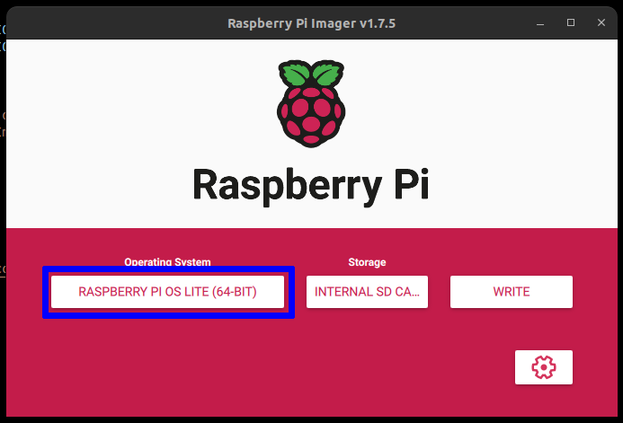
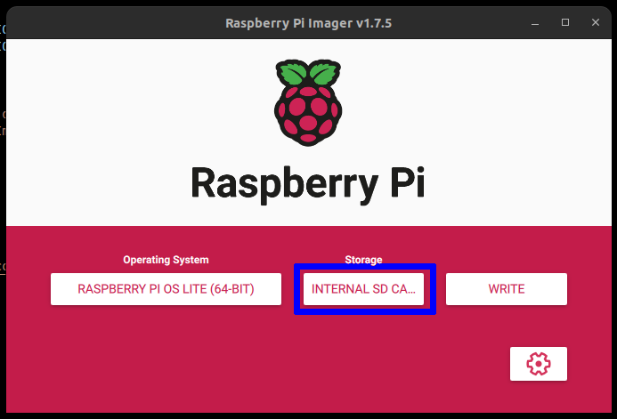
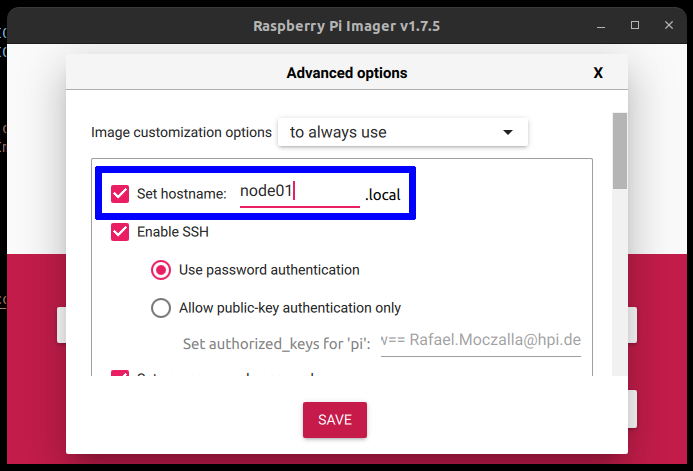
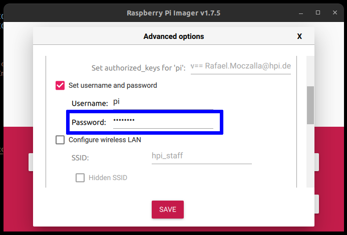

## Build a HPC-Cluster with Raspberry Pis

This tutorial describes how to setup the Raspberry Pi Cluster with 5 Nodes and how to prepare the SD cards with an Pi operating system.

### Hardware-List

* 1× Raspberry Pi Rack
* 5× 1m Ethernet cables
* 1x 2m Ethernet cables
* 5× USB-C to USB 2.0
* 5× Micro SD card (128 GB)
* 1x SD card USB reader
* 1x Ethernet to USB Adapter
* 1x Ethernet switch
* 1x Power supply for Ethernet switch
* 1x Anker power supply and power cord
### Connecting All Components

Connect the USB C to USB 2.0 cables into the Anker power supply and the Ethernet cables into the switch and the Pis. Lastly connect the USB Ethernet Dongle to your laptop and connect an Ethernet cable to the Dongle and the Pi switch. Power on the Switch and Anker power supply. The cluster should look similar to the following image.

### Prepare Micro SD Cards

We already inserted the SD-Cards into the Pi cluster. You need to remove them one by one and follow the instructions. After that, we setup our SD-Cards and install the OS for our Raspberry Pis. Download the Raspberry Pi Imager [here](https://www.raspberrypi.com/software/https://www.raspberrypi.com/software/) and plug in your SD-Card. Select **Raspberry Pi OS Lite (64 Bit)** as the operating system of the Pi nodes.

Insert the SD card into your laptop and select the SD card in the imager.

Additionally, go to settings and set the hostname in the advanced options ( `node01`, `node02`, ..., `node05`), enable ssh and set `raspberry` as the password.

And finally write the image to the SD card.

After preparing all SD-cards the tutorial splits and explains for mac, Windows and Ubuntu users how to connect to the Pi cluster via network with ssh. Make sure to open the appropriate `tutorial_01_[..].md`. The `tutorial_01_clustersetup_and_ssh_with_[mac|ubuntu|windows]_workstation.md` name gives you a hint on which operating system is targeted.
