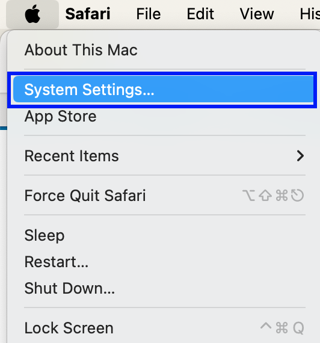
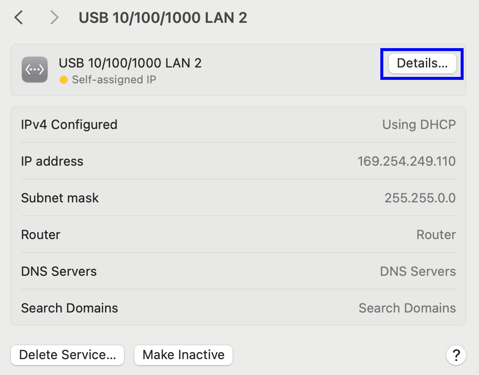
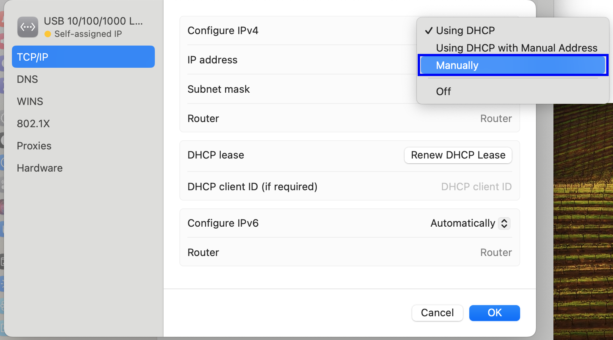
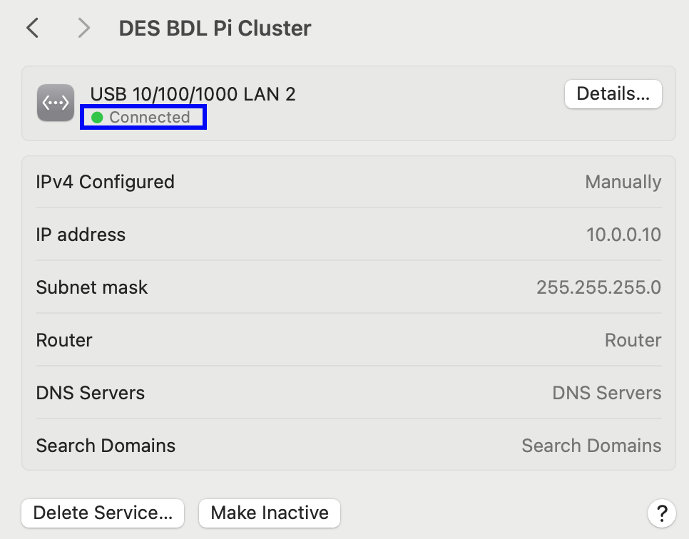

## Build a HPC-Cluster with Raspberry Pis

Now we will install an OS on the Pi nodes, setup static IP addresses and ssh connections for further tutorials.

### Setup Workstation Network

After inserting the Ethernet USB Device into your laptop open the Network settings. First go to system settings.



Than go to network settings. To do that click on the `Network` button.


Select the device connected to the Pi cluster and set the IPv4 configuration to `Manuell`.


To change the IP address to a static one click on `Details`.



First we have to change the IPv4 configuration to static IP by selecting the option `Manually`.



Next set the IP address to `10.0.0.10` and the subnet to `255.255.255.0` and click on `OK`.


When the static IP setup went well you should see the following window and when you connect the USB Ethernet adapter with LAN cable to the powered on switch the network should be connected.



Next we set the hostnames for our cluster nodes. Open the `/etc/hosts` file and add the following lines at the end.

hosts:

```
[...]

# Pi Cluster
10.0.0.1	node01
10.0.0.2	node02
10.0.0.3	node03
10.0.0.4	node04
10.0.0.5	node05
# End of section
```

### Share the Internet Connection

First we enable IP forwarding. Open a shell and enable ip forwarding with `sysctl`.

```
sudo sysctl -w net.inet.ip.forwarding=1
sudo sysctl -w net.inet6.ip6.forwarding=1
```

Next we create a NAT to forward packages from you device that has the internet connection to the Pi cluster. For that purpose we first define a `nat-rules` file and add the NAT rules. Here `en0` is the name of the device with the internet connection. You can figure out the device name with the `ifconfig` command.

nat-rules:

```
scrub on en0 reassemble tcp no-df random-id
nat on en0 from 10.0.0.0/24 to any -> en0
```

Next we deactivate the packet filter device controller, flush all rules and enable our new rules. For that run the following commands in the terminal.

```
sudo pfctl -d
sudo pfctl -F all
sudo pfctl -e -f ./nat-rules
sudo pfctl -s all
```

### Setup Pi Cluster Network

First we give each cluster node a static IP. Mount rootfs on the SD card. On Ubuntu that usually works automatically by inserting the SD card into your laptop. Add an interface file into to the interfaces folder  `[...]/bootfs/cmdline.txt` and add `ip=10.0.0.<nodeID>` at the and of the line. That will change the IP of the node to a static IP such that we can access it from mac. **Make sure you choose for each node one of the** `<nodeID>` **IDs 1, 2, ... and 5.** Repeat the process for all Pi nodes and insert the SD cards into the cluster.

Next we setup the network and ssh for each Pi node. First open a Terminal and login to the node with `ssh pi@node0<nodeID>`\`. The password is as previously selected `raspberry`.

```shellscript
ssh pi@node0<nodeID>
```

On the Pi we first setup the network interface. Create a new file `/etc/network/interfaces.d/eth0` and add the node IP, the netmask with subnet length 24, the workstation IP as the default gateway and Googles server as the DNS nameserver.

```
sudo nano /etc/network/interfaces.d/eth0
```

eth0:

```shellscript
auto eth0
iface eth0 inet static
	address 10.0.0.<nodeID>
	netmask 255.255.255.0
	gateway 10.0.0.10
	dns-nameserver 8.8.8.8
```

Next also modify `/etc/hosts`  as previously on your laptop such that each node of the cluster can see all other nodes. Add the mapping of hostnames to IPs to the end of the file.

```
sudo nano /etc/hosts
```

hosts:

```
[...]

10.0.0.1	node01
10.0.0.2	node02
10.0.0.3	node03
10.0.0.4	node04
10.0.0.5	node05
```

After modifying all SD cards insert them into the Pi cluster and restart it by powering off and on the whole system. After a warm-up time ping all nodes with `ping node01` ,  `ping node02` , etc. to see if everything is working. The startup can take up to 3 Minutes.

### Setup the Pi Nodes

This section has to be repeat for each node. Connect to the node with `ssh pi@node0<nodeID>`. Once you successfully SSH into the PI, upgrade the package manager with:

```
ssh pi@node0<nodeID>
sudo apt update
sudo apt upgrade
```

Next setup passwordless ssh. First create a key pair and then copy the public key to all nodes.

```shellscript
ssh-keygen -q -t ed25519 -N '' <<< $'\ny' >/dev/null 2>&1

ssh-copy-id -o StrictHostKeyChecking=accept-new pi@node01
ssh-copy-id -o StrictHostKeyChecking=accept-new pi@node02
ssh-copy-id -o StrictHostKeyChecking=accept-new pi@node03
ssh-copy-id -o StrictHostKeyChecking=accept-new pi@node04
ssh-copy-id -o StrictHostKeyChecking=accept-new pi@node05
```

Finally we create a `~/.environment_variables` file that will be always executed by the `~/.bashrc` file when logging into the Pis. Therefore we add a line to the start of the `~/.bashrc` file.

.bashrc:

```shellscript
# ~/.bashrc: executed by bash(1) for non-login shells.
# see /usr/share/doc/bash/examples/startup-files (in the package bash-doc)
# for examples

. ~/.environment_variables

# If not running interactively, don't do anything
case $- in
    *i*) ;;
      *) return;;
esac

[...]
```