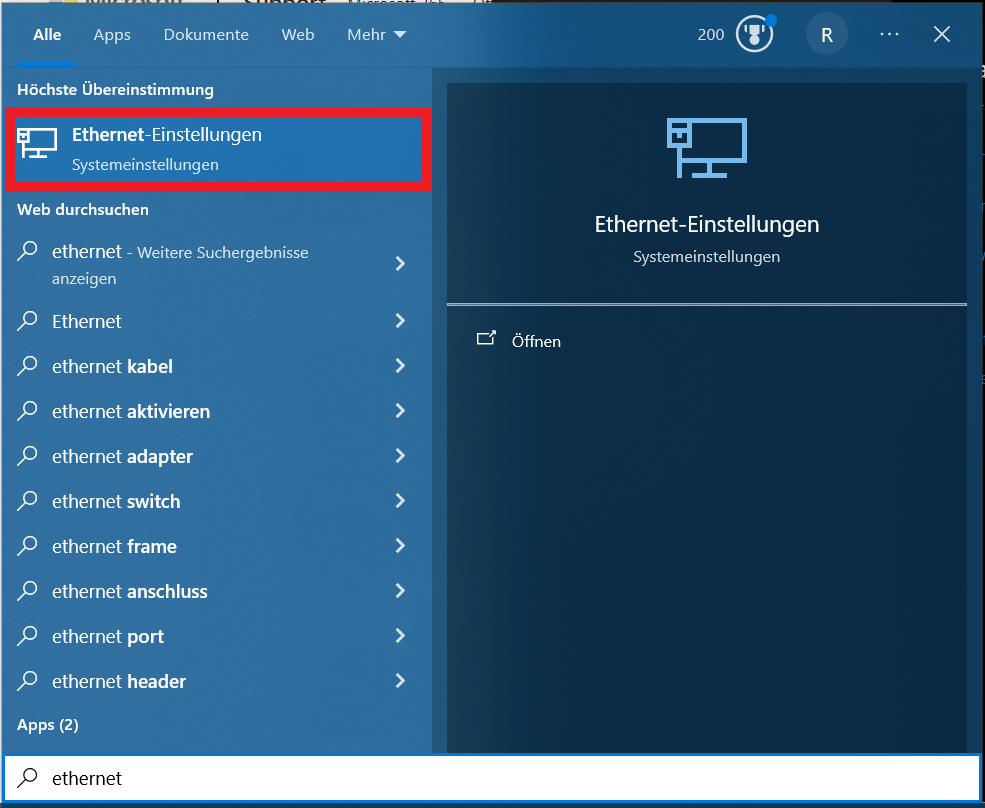

## Build a HPC-Cluster with Raspberry Pis

Now we will install an OS on the Pi nodes, setup static IP addresses and ssh connections for further tutorials.

### Setup Workstation Network

After inserting the Ethernet USB Device into your laptop open the Ethernet settings.



Next click on the new not identified Ethernet Network.


Click on the IP editing button to modify the IP of the network device.


Select `Manuell` and enable only IPv4. Set the IP address `10.0.0.10`, the subnet `255.255.255.0` represented as subnet length `24`, the gateway `10.0.0.0` and `8.8.8.8` as well as `8.8.4.4` as the DNS and alternative DNS servers. Apply the changes by clicking on the Save button.


Next we set the hostnames for our cluster nodes. Open an editor as an administrator and add at the bottom of file `C:\Windows\System32\drivers\etc\hosts` the following lines.

hosts:

```
[...]

# Pi Cluster
10.0.0.1	node01
10.0.0.2	node02
10.0.0.3	node03
10.0.0.4	node04
10.0.0.5	node05
# End of section
```

Next we enable IP forwarding. Open a Windows PowerShell as administrator and enable IP forwarding with `Set-NetIPInterface -Forwarding Enabled`. After that check if IP forwarding is activated with `Get-NetIPInterface | select ifIndex,InterfaceAlias,AddressFamily,ConnectionState,Forwarding | Sort-Object -Property IfIndex | Format-Table`.

```
Set-NetIPInterface -Forwarding Enabled
Get-NetIPInterface | select ifIndex,InterfaceAlias,AddressFamily,ConnectionState,Forwarding | Sort-Object -Property IfIndex | Format-Table

ifIndex InterfaceAlias               AddressFamily ConnectionState Forwarding
------- --------------               ------------- --------------- ----------
      1 Loopback Pseudo-Interface 1           IPv6       Connected    Enabled
      1 Loopback Pseudo-Interface 1           IPv4       Connected    Enabled
      1 WLAN                                  IPv4       Connected    Enabled
     3 Ethernet                               IPv6       Connected    Enabled
     3 Ethernet                               IPv4       Connected    Enabled
```

Next we enable IP forwarding. Open a Windows PowerShell as administrator and enable IP forwarding with `Set-NetIPInterface -Forwarding Enabled`. After that check if IP forwarding is activated with `Get-NetIPInterface | select ifIndex,InterfaceAlias,AddressFamily,ConnectionState,Forwarding | Sort-Object -Property IfIndex | Format-Table`.

```
Set-NetIPInterface -Forwarding Enabled
Get-NetIPInterface | select ifIndex,InterfaceAlias,AddressFamily,ConnectionState,Forwarding | Sort-Object -Property IfIndex | Format-Table

ifIndex InterfaceAlias               AddressFamily ConnectionState Forwarding
------- --------------               ------------- --------------- ----------
      1 Loopback Pseudo-Interface 1           IPv6       Connected    Enabled
      1 Loopback Pseudo-Interface 1           IPv4       Connected    Enabled
      1 WLAN                                  IPv4       Connected    Enabled
     3 Ethernet                               IPv6       Connected    Enabled
     3 Ethernet                               IPv4       Connected    Enabled
```

### Setup Pi Cluster Network

First we give each cluster node a static IP. Mount rootfs on the SD card. On Ubuntu that usually works automatically by inserting the SD card into your laptop. Add an interface file into to the interfaces folder  `[...]/bootfs/cmdline.txt` and add `ip=10.0.0.<nodeID>` at the and of the line. That will change the IP of the node to a static IP such that we can access it from windows. **Make sure you choose for each node one of the** `<nodeID>` **IDs 1, 2, ... and 5.** Repeat the process for all Pi nodes and insert the SD cards into the cluster.

Next we setup the network and ssh for each Pi node. First open a Windows PowerShell and login to the node with `ssh pi@node0<nodeID>`\`. The password is as previously selected `raspberry`.

```shellscript
ssh pi@node0<nodeID>
```

On the Pi we first setup the network interface. Create a new file `/etc/network/interfaces.d/eth0` and add the node IP, the netmask with subnet length 24, the workstation IP as the default gateway and Googles server as the DNS nameserver.

```
sudo nano /etc/network/interfaces.d/eth0
```

eth0:

```shellscript
auto eth0
iface eth0 inet static
	address 10.0.0.<nodeID>
	netmask 255.255.255.0
	gateway 10.0.0.10
	dns-nameserver 8.8.8.8
```

Next also modify `/etc/hosts`  as previously on your laptop such that each node of the cluster can see all other nodes. Add the mapping of hostnames to IPs to the end of the file.

```
sudo nano /etc/hosts
```

hosts:

```
[...]

10.0.0.1	node01
10.0.0.2	node02
10.0.0.3	node03
10.0.0.4	node04
10.0.0.5	node05
```

After modifying all SD cards insert them into the Pi cluster and restart it by powering off and on the whole system. After a warm-up time ping all nodes with `ping node01` ,  `ping node02` , etc. to see if everything is working. The startup can take up to 3 Minutes.

### Share the Internet Connection

Next we share the internet connection with the Pi cluster. In Windows go to the settings of network connections.


Right click on the network interface that provides the internet and select properties.


Under sharing check the checkbox and select the name of the network device connected to the pi cluster. Click on OK when you selected everything.


Done! Now your Pi cluster should have a working internet connection.

### Setup the Pi Nodes

This section has to be repeat for each node. Connect to the node with `ssh pi@node0<nodeID>`. Once you successfully SSH into the PI, upgrade the package manager with:

```
ssh pi@node0<nodeID>
sudo apt update
sudo apt upgrade
```

Next setup passwordless ssh. First create a key pair and then copy the public key to all nodes.

```shellscript
ssh-keygen -q -t ed25519 -N '' <<< \\\$'\ny' >/dev/null 2>&1

ssh-copy-id -o StrictHostKeyChecking=accept-new pi@node01
ssh-copy-id -o StrictHostKeyChecking=accept-new pi@node02
ssh-copy-id -o StrictHostKeyChecking=accept-new pi@node03
ssh-copy-id -o StrictHostKeyChecking=accept-new pi@node04
ssh-copy-id -o StrictHostKeyChecking=accept-new pi@node05
```

Finally we create a `~/.environment_variables` file that will be always executed by the `~/.bashrc` file when logging into the Pis. Therefore we add a line to the start of the `~/.bashrc` file.

.bashrc:

```shellscript
# ~/.bashrc: executed by bash(1) for non-login shells.
# see /usr/share/doc/bash/examples/startup-files (in the package bash-doc)
# for examples

. ~/.environment_variables

# If not running interactively, don't do anything
case $- in
    *i*) ;;
      *) return;;
esac

[...]
```